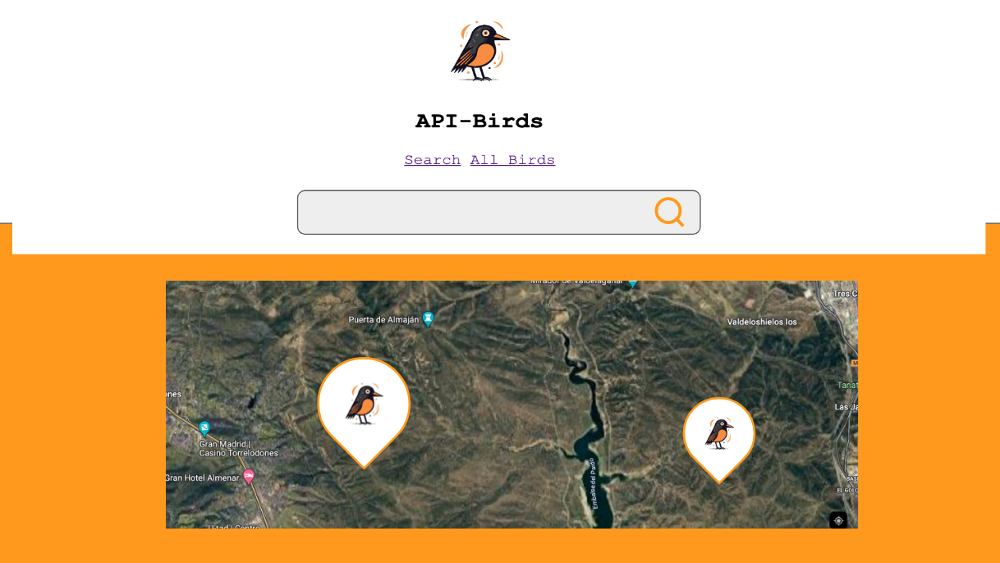

# API-Birds

##What is API-Birds##

API-Birds is a web application to find locations where some bird specie has been sighted. It shows the result of a search by bird common name or official name in a map. 

##Technologies##

Vanilla JavaScript
HTML5
CSS3

###Use of:###

Local Storage
DOM manipulation
API connection
Asnync functions

##Index appearance##

